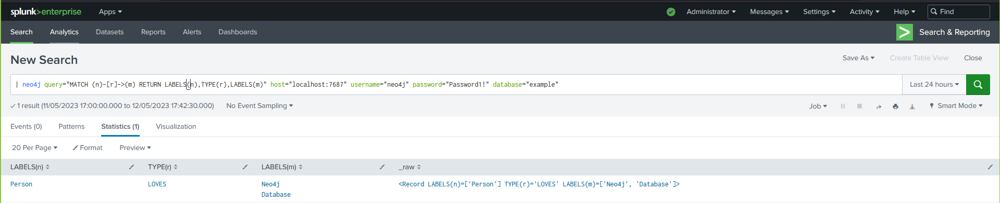

# neo4j-splunk
## Use the power of neo4j over Splunk.
<p align="center">
<a href="https://github.com/MoshiAL/neo4j-splunk"></a>
</p>


This app is a fork of the neo4s app https://github.com/omerl13/neo4s, updated to support newer neo4j versions and to allow taking advantage of the multiple dbs in neo4j.

This app allows you to run cypher queries and get the results, all over splunk. This allows you to take advantage of both neo4j's cypher and splunk's SPL.

## Examples

Basic usage:
```
| neo4j host="mygraph.com:7687" query="MATCH (n)-[r]->(m) RETURN n,r,m" | table *
```

Using neo4j authentication:
```
| neo4j host="secretgraph.com:7687" username="neo4j" password="neo4j" query="MATCH (n) RETURN n LIMIT 10"
```

Using different scheme:
```
| neo4j host="mygraph.com:7687" scheme="neo4j" query="MATCH (n) RETURN n" | table *
```

Using different database:
```
| neo4j host="mygraph.com:7687" database="mydb" query="MATCH (n)-[r]->(m) RETURN n,r,m" | table *
```

## How it looks in splunk


## Options
- <b>`host`</b> <i>(required)</i>: Hostname + graph port (port is optional)
- <b>`query`</b> <i>(required)</i>: Cypher query to run on the graph (can be of any kind)
- <b>`username`</b> <i>(optional)</i>: Username for authentication
- <b>`password`</b> <i>(optional)</i>: Password for authentication
- <b>`scheme`</b> <i>(optional)</i>: Default to bolt
- <b>`database`</b> <i>(optional)</i>: Default to neo4j

## Protocol
The default is bolt, in order to use different scheme in the url, set `scheme="<scheme_name>"` and use the appropriate port at the end of the `host` parameter.

## Credits
- Uses neo4j official python client [neo4j-driver](https://neo4j.com/docs/api/python-driver/current/)
- Uses pytz python packages [pytz](https://pythonhosted.org/pytz/)
- App icon is taken from [Icons8](https://icons8.com/)
